# TTRPG AI Game Master

A RAG-powered AI Game Master for tabletop RPGs. Players pick a pre-loaded rulebook,
start a campaign, and chat with an AI that knows the rules, remembers the story,
and can host multiple players in a shared room.

---

## Architecture

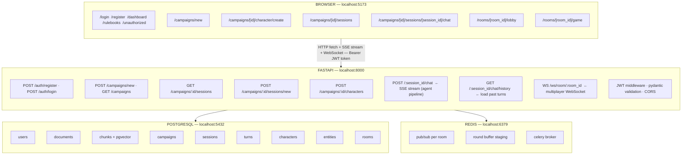

---

## Agent Pipeline (Chat Endpoint)

```mermaid
flowchart TD
    Start(["Player message(s)<br/><i>multiplayer: all players' actions collected<br/>in round buffer, then flushed via /gm resolve</i>"])

    Start --> Classifier

    subgraph Classifier["INTENT CLASSIFIER — classifier.py"]
        C1["fast LLM call (llama3.1:8b)<br/>returns Intent dataclass:<br/>intent type (1 of 6) · topics list for RAG · roll_needed / roll_provided"]
    end

    Classifier --> ToolMap

    subgraph ToolMap["TOOL_MAP lookup — tools.py"]
        direction LR
        T1["rules_question → fetch_rag"]
        T2["lore_question → fetch_rag"]
        T3["world_question → fetch_rag"]
        T4["story_action → fetch_rag + fetch_history + fetch_world_state"]
        T5["action_with_roll → fetch_rag + fetch_character + fetch_history + fetch_roll"]
        T6["character_query → fetch_character"]
    end

    ToolMap --> Tools

    subgraph Tools["TOOLS EXECUTE"]
        direction LR
        TE1["fetch_rag → hybrid search (dense + BM25) + rerank → top 8 chunks"]
        TE2["fetch_character → reads characters table (all party members)"]
        TE3["fetch_history → reads turns table (last 12)"]
        TE4["fetch_world_state → reads entities table"]
        TE5["fetch_roll → parses dice notation, rolls, returns result"]
    end

    Tools --> Prompt

    subgraph Prompt["PROMPT_MAP lookup — gm.py"]
        PR1["picks template based on intent<br/>fills template with tool results<br/>includes party_context block for multiplayer sessions"]
    end

    Prompt --> Narrator

    subgraph Narrator["GM NARRATOR — hermes3 (Ollama)"]
        N1["extended thinking: internal reasoning pass first<br/>then narrative output<br/>SSE tokens → broadcast to all room WebSockets"]
    end

    Narrator --> Save

    subgraph Save["SAVE TURN"]
        S1["save player_msg + gm_response to turns table"]
        S2["if turns % 20 == 0 → trigger summary (Celery)"]
    end
```

---

## Multiplayer Round Buffer

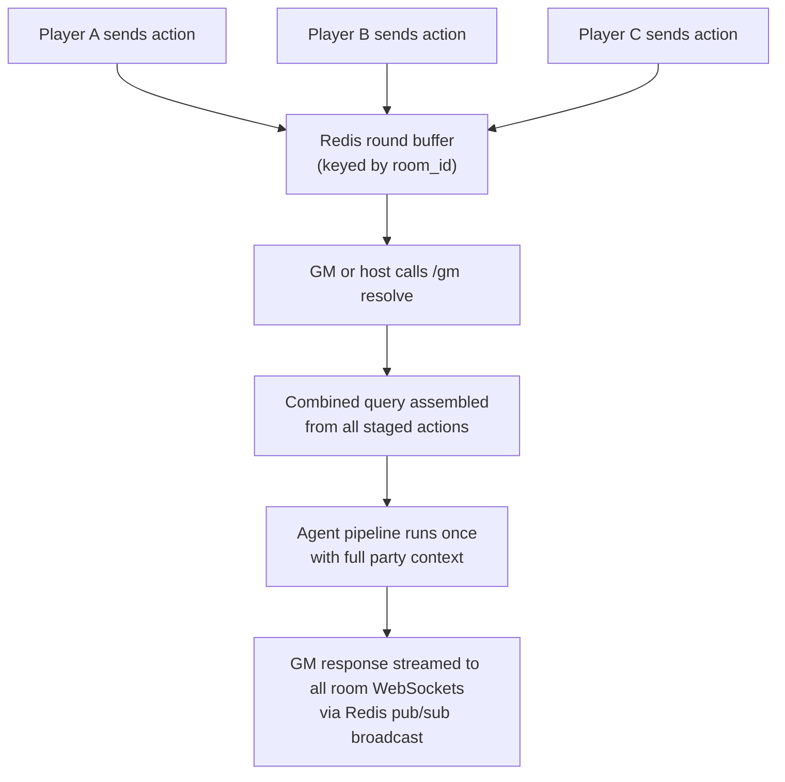

---

## RAG Pipeline

### Ingest (one-time script)

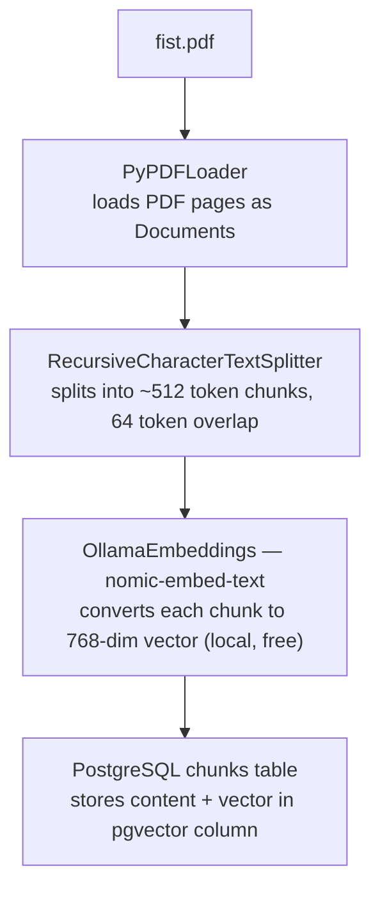

### Query (every player message)

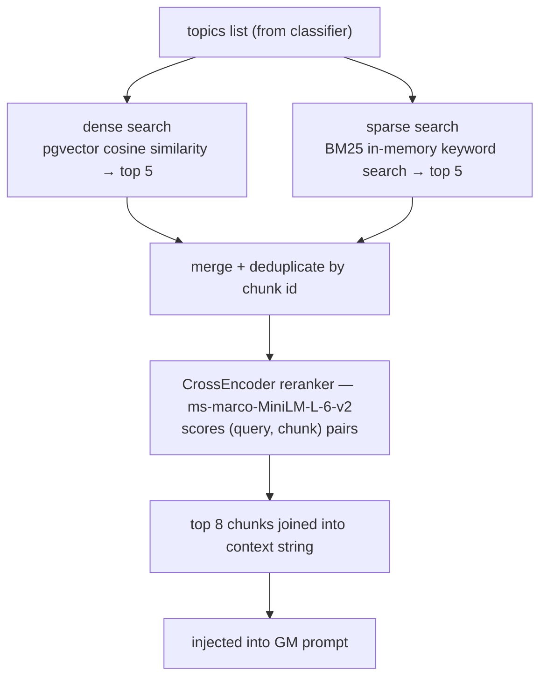

---

## Database Schema

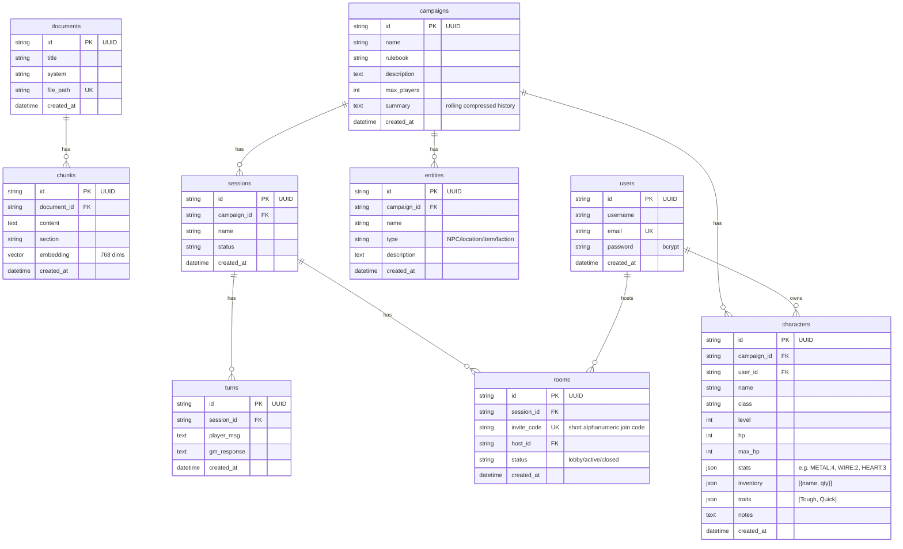

---

## Redis-WebSocket Flow

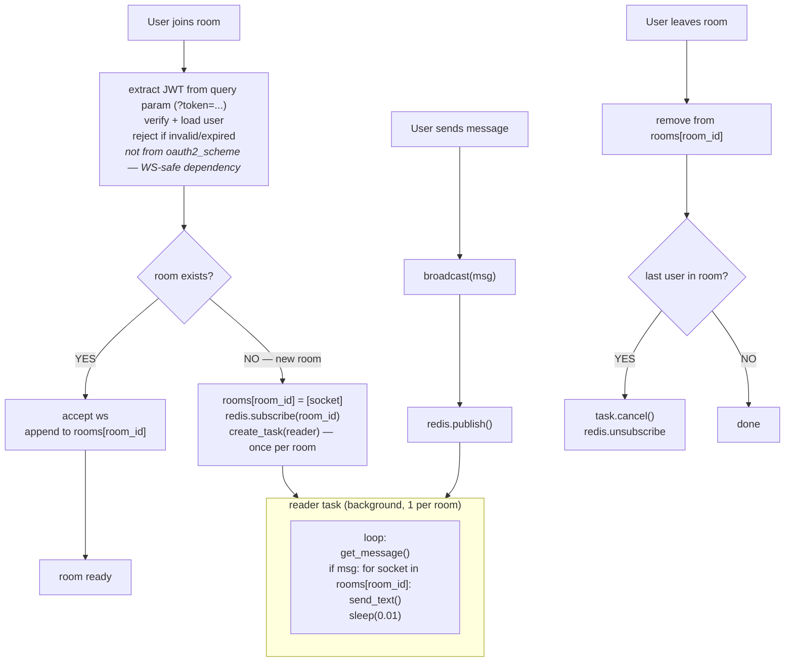

**Notes:**
- 1 pubsub reader task per room, not per user
- reader lives until the last user leaves
- JWT extracted from query param, not Authorization header
- presence tracked via connect/disconnect events → broadcast to room

---

## Why Redis pub/sub — not direct broadcast

Without Redis, broadcasting means the sender's WebSocket handler loops over
every other connection and calls `send()` directly. This works, but only if all
connections live in the same server process.

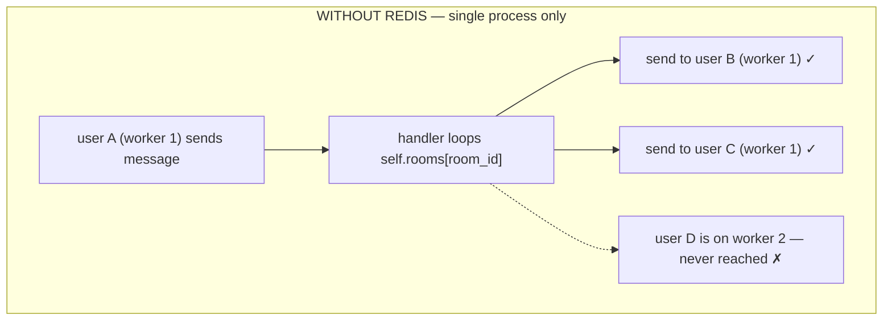

With Redis, any process publishes to a channel. Every process subscribed to
that channel receives it and fans out to its own local connections. Processes
don't need to know about each other.

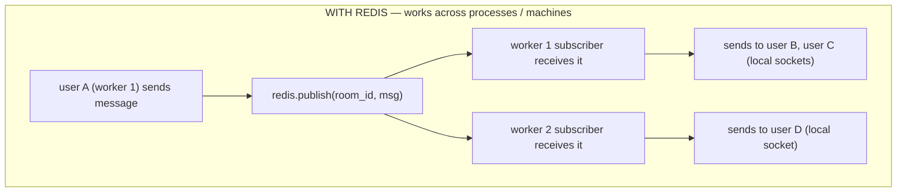

For this project there is only one Uvicorn worker, so Redis is not strictly
required for correctness right now. It is used anyway because:

1. the round buffer (staged player actions) needs a shared store that
   survives across requests, which in-memory dicts cannot provide
2. Celery uses Redis as its task broker for background summarisation
3. when deploy time comes, scaling to multiple workers requires zero
   changes to the WebSocket code — Redis already handles it

---

## Services Structure

```
services/
├── rag.py          ← embedding + hybrid search (dense + BM25) + reranking
├── gm.py           ← PROMPT_MAP + 6 prompt templates + stream_gm_response
│                      party_context block injected for multiplayer sessions
├── classifier.py   ← classify(message) → Intent dataclass
└── tools.py        ← TOOL_MAP + fetch_rag, fetch_character (all party members),
                       fetch_history, fetch_world_state, fetch_roll
```

---

## Intent Types + Tool Map

| Intent | RAG | Character | History | World State | Roll |
|---|---|---|---|---|---|
| rules_question | ✓ | | | | |
| lore_question | ✓ | | | | |
| world_question_from_rulebook | ✓ | | | | |
| story_action | ✓ | | ✓ | ✓ | |
| action_with_dice_roll | ✓ | ✓ | ✓ | | ✓ |
| character_query | | ✓ | | | |

---

## Rolling Summary

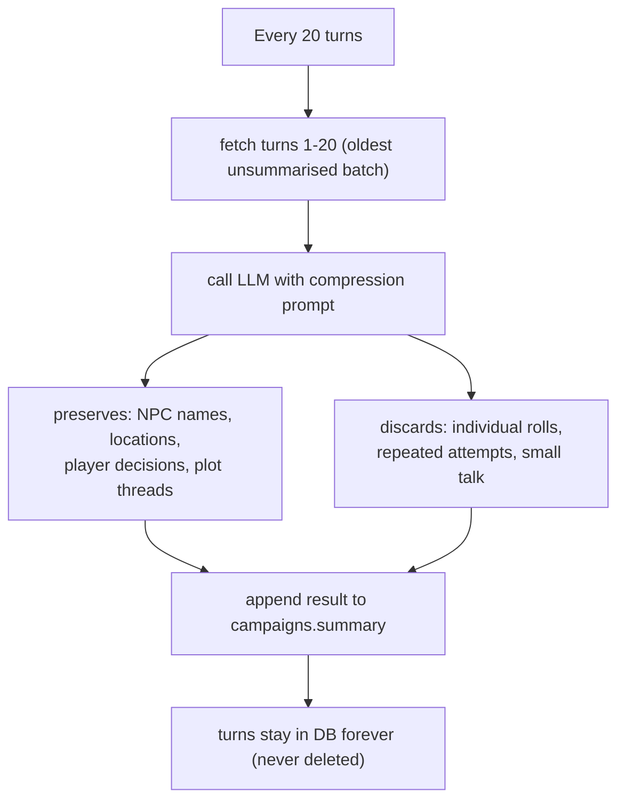

GM prompt always contains:

| Block | Contents |
|---|---|
| `<party_context>` | all player characters in the room (multiplayer) |
| `<campaign_summary>` | compressed history of everything before window |
| `<recent_turns>` | last 12 turns verbatim |

---

## Tech Stack

| Layer | Technology | Why |
|---|---|---|
| API server | FastAPI + Python 3.13 | async, typed, auto docs |
| Server | Uvicorn | ASGI server that runs FastAPI |
| ORM | SQLAlchemy | most widely used Python ORM |
| DB driver | psycopg2 | Postgres driver for SQLAlchemy |
| Database | PostgreSQL 17 + pgvector | one DB for everything |
| Migrations | Alembic | schema version control |
| Embeddings | nomic-embed-text via Ollama | free, local, 768 dims |
| Sparse search | BM25 (rank-bm25 / LlamaIndex) | keyword search over chunks |
| Reranker | CrossEncoder ms-marco-MiniLM | scores (query, chunk) relevance |
| PDF parsing | PyPDFLoader + LangChain | loads and splits rulebook PDFs |
| LLM (GM) | hermes3 via Ollama | extended thinking + narration |
| LLM (classifier) | llama3.1:8b via Ollama | fast intent classification |
| SSE streaming | sse-starlette | streams LLM tokens to browser |
| WebSocket | FastAPI WebSocket | multiplayer real-time comms |
| Pub/sub | Redis pub/sub | cross-room WebSocket broadcast |
| Frontend | SvelteKit + Tailwind | lighter than Next.js |
| Auth | JWT + python-jose | stateless token auth |
| WS Auth | query param token + custom dep | oauth2_scheme incompatible with WS |
| Package mgr | Poetry | virtualenv + dependency management |
| Containers | Docker Compose | local Postgres + Redis |
| Background | Celery + Redis | session summaries |

---

## Project Structure

```
TTRPG-GM/
├── app/
│   ├── pyproject.toml
│   ├── docker-compose.yml
│   ├── .env
│   ├── alembic/
│   └── src/app/
│       ├── main.py
│       ├── config.py
│       ├── db/db.py
│       ├── models/
│       │   ├── user.py
│       │   ├── document.py
│       │   ├── chunk.py
│       │   ├── campaign.py
│       │   ├── session.py
│       │   ├── turn.py
│       │   ├── character.py
│       │   ├── entity.py
│       │   └── room.py
│       ├── routers/
│       │   ├── auth.py
│       │   ├── routes.py
│       │   └── ws.py          ← WebSocket room endpoints
│       ├── services/
│       │   ├── rag.py
│       │   ├── gm.py
│       │   ├── classifier.py
│       │   └── tools.py
│       ├── pdfs/fist.pdf
│       └── scripts/ingest.py
│
└── web/
    ├── .env
    └── src/
        ├── lib/auth.ts
        └── routes/
            ├── login/+page.svelte
            ├── register/+page.svelte
            ├── dashboard/+page.svelte
            ├── rulebooks/+page.svelte
            ├── unauthorized/+page.svelte
            └── campaigns/
                ├── new/+page.svelte
                └── [id]/
                    ├── character/create/+page.svelte
                    └── sessions/
                        ├── +page.svelte
                        ├── [session_id]/chat/+page.svelte
                        └── [session_id]/rooms/
                            └── [room_id]/
                                ├── lobby/+page.svelte   ← invite code + ready state
                                └── game/+page.svelte    ← shared narration + action input
```

---

## Pages Built

```
/login                                                   ← JWT auth
/register                                                ← account creation
/dashboard                                               ← campaign list
/rulebooks                                               ← FIST rulebook hardcoded
/unauthorized                                            ← no token redirect
/campaigns/new                                           ← 3-phase campaign creation
/campaigns/[id]/character/create                        ← 5-phase character creation + dice
/campaigns/[id]/sessions                                 ← session list + create session
/campaigns/[id]/sessions/[session_id]/chat              ← GM chat + SSE stream + history
/campaigns/[id]/sessions/[session_id]/rooms/[room_id]/lobby  ← invite code + ready state
/campaigns/[id]/sessions/[session_id]/rooms/[room_id]/game   ← multiplayer game view
```

Design system — all pages:
- Monochrome black + white
- Bebas Neue display + Share Tech Mono
- Fake browser chrome + ruler at top
- Scrolling ticker + barcode at bottom
- Chinese subtitle text

---

## Multiplayer UI — Lobby Page

```
┌─────────────────────────────────────────────────────┐
│  ROOM LOBBY                                         │
│                                                     │
│  Invite Code: [ XKCD-42 ]  ← copy to clipboard     │
│                                                     │
│  Players                                            │
│  ● Jake (host)     [READY]                          │
│  ● Alex            [READY]                          │
│  ● Morgan          [waiting...]                     │
│                                                     │
│  ● = green dot presence indicator                   │
│                                                     │
│  [ START GAME ]  ← host only, all-ready gated       │
└─────────────────────────────────────────────────────┘
```

## Multiplayer UI — Game View

```
┌──────────────────────────────────────────────────────────────┐
│  ┌────────────────────────────┐  ┌────────────────────────┐  │
│  │   PARTY                   │  │   GM NARRATION         │  │
│  │                           │  │                        │  │
│  │  ● Jake                   │  │  [streaming GM text    │  │
│  │    Rook / Soldier         │  │   broadcast to all     │  │
│  │    HP: 12/14              │  │   players in room]     │  │
│  │                           │  │                        │  │
│  │  ● Alex                   │  └────────────────────────┘  │
│  │    Sable / Medic          │                              │
│  │    HP: 8/10               │  ┌────────────────────────┐  │
│  │                           │  │   YOUR ACTION          │  │
│  │  ○ Morgan  (disconnected) │  │                        │  │
│  │    Vex / Hacker           │  │  [ type your action ]  │  │
│  │    HP: 6/6                │  │  [ SUBMIT ]            │  │
│  │                           │  │                        │  │
│  └────────────────────────────┘  │  Staged: waiting for  │  │
│                                  │  other players...     │  │
│                                  └────────────────────────┘  │
└──────────────────────────────────────────────────────────────┘

  ● = connected (green dot)
  ○ = disconnected (grey dot)
  action input disabled while GM is narrating
  all players see the same narration panel in real time
```

---

## Auth Flow

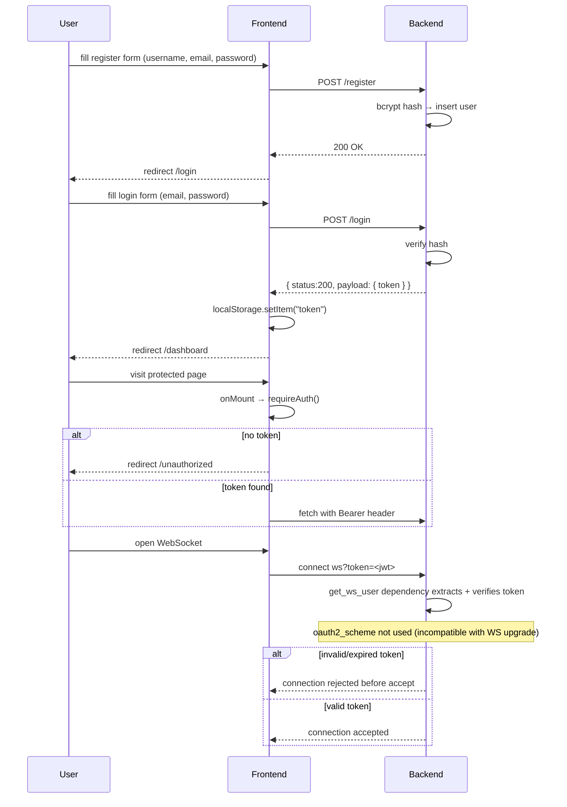

---

## Running the Project

```bash
# 1 — start Postgres + Redis
docker compose up -d

# 2 — run migrations
cd app
poetry run alembic upgrade head

# 3 — start Ollama
ollama serve
ollama pull nomic-embed-text
ollama pull hermes3
ollama pull llama3.1:8b

# 4 — ingest rulebook (one time)
poetry run python src/app/scripts/ingest.py

# 5 — start backend
poetry run uvicorn src.app.main:app --reload

# 6 — start frontend
cd web && npm run dev
```

| Service | URL |
|---|---|
| Frontend | http://localhost:5173 |
| Backend | http://localhost:8000 |
| Swagger | http://localhost:8000/docs |
| Ollama | http://localhost:11434 |

---

## Progress

```
MONTH 1 — FOUNDATION
  ✓ Week 1 — FastAPI + auth + Docker + pgvector
  ✓ Week 2 — SvelteKit + all auth pages + dashboard
  ✓ Week 3 — RAG ingest script + pgvector search
  ✓ Week 4 — SSE chat + turns table + history reload

MONTH 2 — INTELLIGENCE
  ✓ Week 5 — Intent classifier + TOOL_MAP + PROMPT_MAP
              + hybrid RAG (BM25 + dense + reranking)
              + character creation page
  ✓ Week 6 — Rolling summary (every 20 turns → campaigns.summary)
  ░ Week 7 — Entity extraction (Celery background tasks)
  ✓ Week 8 — Campaign dashboard with entity log

MONTH 3 — MULTIPLAYER
  ✓ Week 9  — WebSocket rooms + Redis pub/sub
              + round buffer (player actions staged, flushed via /gm resolve)
              + WebSocket streaming of GM response to all room participants
  ░ Week 10 — WebSocket auth hardening
              · replace oauth2_scheme with custom get_ws_user dependency
              · extract JWT from ?token= query param
              · reject connection before accept on invalid/expired token

              Multiplayer UI
              · Room lobby page — invite code display, player list,
                ready state per player, host-only Start button
              · Game view — shared narration panel + per-player action input
              · Live presence indicators (● connected / ○ disconnected)
              · Player sidebar — mini character cards for full party

              GM pipeline multiplayer support
              · Switch GM model to hermes3 (extended thinking + narration)
              · party_context block injected into all GM prompts
                (all player characters included, not just the sender)
              · fetch_character tool updated to return full party roster
              · GM response broadcast to all room WebSockets via pub/sub

  ░ Week 11 — Polish + rate limiting
  ░ Week 12 — Deploy: Railway + Vercel
```

---

## Useful Links

| Topic | Link |
|---|---|
| FastAPI | https://fastapi.tiangolo.com |
| SQLAlchemy | https://docs.sqlalchemy.org/en/20/orm/quickstart.html |
| Alembic | https://alembic.sqlalchemy.org/en/latest/tutorial.html |
| pgvector | https://github.com/pgvector/pgvector |
| LlamaIndex BM25 | https://docs.llamaindex.ai/en/stable/examples/retrievers/bm25_retriever/ |
| CrossEncoder | https://www.sbert.net/docs/cross_encoder/usage/usage.html |
| ms-marco reranker | https://huggingface.co/cross-encoder/ms-marco-MiniLM-L-6-v2 |
| Ollama | https://ollama.com |
| hermes3 | https://ollama.com/library/hermes3 |
| sse-starlette | https://github.com/sysid/sse-starlette |
| SvelteKit | https://svelte.dev/docs/kit/introduction |
| Anthropic API | https://docs.anthropic.com/en/api/getting-started |
| Poetry | https://python-poetry.org/docs/ |
| Pinecone RAG guide | https://www.pinecone.io/learn/series/rag/rerankers/ |

---

## .gitignore

```
.env
__pycache__/
.venv/
*.pyc
.DS_Store
node_modules/
.svelte-kit/
pdfs/
```